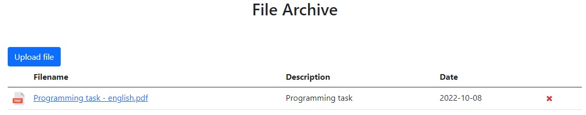

# File-Archive

## Pre-requisites
1. [Postgres](https://www.enterprisedb.com/downloads/postgres-postgresql-downloads)
2. [Python3](https://www.python.org/downloads/windows/) (version 3.8 or later)

## How to run
1. Create a Postgres database
2. Run `pip install -r requirements.txt`
3. Create a .env file in the root directory with the variable `DATABASE_PATH="path_to_postgres_db"`
4. Run `python app.py` to start the application. View the web application on: http://localhost:5000/

## Features
- Able to upload a file (must be of type pdf, xml or jpeg) and add a description
- Saves file details to a postgres database and file on disk
- Displays all the uploaded files on the page and are persistent after refresh
- Able to delete an uploaded file 
- Displays an icon of the file type
- Able to download the file by pressing the filename
- Appends a number onto duplicate filenames
- Max file upload limit set to 10 megabytes